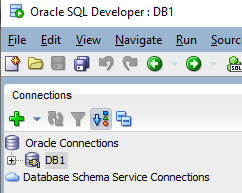

### Setup Oracle Database Example

**Steps:**
<ol>
<li>In this tutorial, I will share how to install 2 Oracle products for development purposes (Offline mode);
<ul>
<li>Oracle Database 19c (19.3) 
<pre style="margin-top: 5px; margin-bottom: 5px">Oracle Database needs to be running in background as service first.</pre></li>
<li>SQL Developer 23.1 
<pre style="margin-top: 5px; margin-bottom: 5px">Oracle Sql Developer will connect to running Oracle Database service  and here you can run your SQL or PLSQL queries  for development purposes.</pre></li>
</ul>
</li>

<li>Download SQL Developer 23.1
<ul>
<li>Via Win Explorer, create new folder 'C:\Oracle_sqldeveloper'</li>
<li>Via Browser, go to 'https://www.oracle.com/database/sqldeveloper/technologies/download/' 
Find 'Windows 64-bit with JDK 11 included' and click 'Download' to download</li>
<kbd></kbd>
<li>Once downloaded, unzip all files from zip to folder 'C:\Oracle_sqldeveloper'.</li>
</ul>
</li>
 

<li>Download Oracle Database 19c (19.3)
<ul>
<li>Via Win Explorer, create new folder 'C:\Oracle19c_installed'</li>
<li>Via Browser, go to 'https://www.oracle.com/database/technologies/oracle-database-software-downloads.html#19c' 
Find 'Oracle Database 19c for Microsoft Windows x64 (64-bit)' and  Click 'WINDOWS.X64_193000_db_home.zip' to download</li>
<kbd></kbd>
<li>Once downloaded, unzip all files from this zip file to folder 'C:\Oracle19c_installed'.</li>
</ul>
</li>
 

<li>Install Oracle Database 19c (19.3)
<ul>
<li>Via Win Explorer, go to folder 'C:\Oracle19c_installed'</li>
<li>Select file 'setup.exe' and press 'Enter' to run setup</li>
<li>You may follow my setup configuration steps in pics shown below</li>
<kbd></kbd>  
<kbd></kbd>
<li>If you type 'C:\Oracle19c', related folders like 'C:\Oracle19c' and 'C:\Oracle19c\oradata' will be auto generated by installer.</li>
<li>Remember the user and password, you will need to use them later in Sql Developer.</li>
<li>As you follow the stages, be patient, it may take up to 20minutes to load till stage 'Finish'.</li>
</ul>
</li>
 

<li>Create User in Oracle Database using SQLPLUS
<ul>
<li>Via Command Prompt,  check if Oracle Database is running first If you forget your 'Service Name'(orcl), you can also check here</li>
<pre style="margin-top: 5px; margin-bottom: 5px">lsnrctl status</pre>

<li>Via Command Prompt,  connect SQLPLUS
<pre style="margin-top: 5px; margin-bottom: 5px">sqlplus / as sysdba</pre></li>
<li>Via SQLPLUS, Create User in Database
<pre style="margin-top: 5px; margin-bottom: 5px">CREATE USER test_user1 IDENTIFIED BY Password1;</pre>
<pre style="margin-top: 5px; margin-bottom: 5px">GRANT CREATE SESSION TO test_user1;</pre>
<pre style="margin-top: 5px; margin-bottom: 5px">GRANT CREATE TABLE TO test_user1;</pre>
<pre style="margin-top: 5px; margin-bottom: 5px">ALTER USER test_user1 QUOTA UNLIMITED ON USERS;</pre>
</li>
<li>(Optional) If you wish to rename user, you may delete (drop) and recreate
<pre style="margin-top: 5px; margin-bottom: 5px">DROP USER test_user1;</pre>
</li>
</ul>
</li>

<li>Open Database Connection in Sql Developer
<ul>
<li>Via Win Explorer, go to folder 'C:\Oracle_sqldeveloper'</li>
<li>Select file 'sqldeveloper.exe' and press 'Enter' to run Sql Developer</li>
<li>Once Sql Developer is opened, click on the green '+' icon, to start a new Database connection</li>
<kbd></kbd>  

<li>Username: test_user1 
Password: Password1 
Service Name: orcl (same as when you setup Oracle 19c earlier)</li>
<li>And, it's good practice to test first, before connect</li>
<kbd></kbd>  
<li>If test 'Success', press 'Connect'</li>
<kbd></kbd>  
<li>You will see your DB name created as a connection on top left here</li>
<kbd></kbd>  
<li>Right click on DB name, to 'Open SQL WorkSheet'</li>
<kbd></kbd>  
<li>Run a simple SQL to test if SQL is working</li>
<pre style="margin-top: 5px; margin-bottom: 5px">select * from all_users where USERNAME like 'TEST%';</pre></li>
<kbd></kbd>  

</ul>
</li>

=================================
<li>(ADDITIONAL INFO) Uninstall Oracle Database (To reinstall or to deal with sticky rename Oracle folder issues)
<ul>
</li>
<li>Via Win Explorer, delete folder 'C:\Oracle_installed'</li>
<li>Via Win Explorer, delete folder 'C:\Oracle19c'</li>
<li>Via Win Explorer, delete folder 'C:\Program Files\Oracle'</li>
<li>Via Regedit, select HKEY_LOCAL_MACHINE > SOFTWARE > ORACLE, press the del key to delete this entry on 'ORACLE' and all subkey under it.</li>
<li>Via Regedit, select HKEY_LOCAL_MACHINE SYSTEM > CurrentControlSet > Services, scroll through the list, delete all Oracle entries</li>
<li>Via Windows Services, stop the Oracle related services starting with 'Oracle' Do not close Windows Services yet, you need information from this window for next step.</li>
<li>Via CMD in admin mode, STOP and DELETE all services starting with 'Oracle'. SC STOP shortservicename 
SC DELETE shortservicename</li>
<li>*Step to REINSTALL, Via Win Explorer, unzip Oracle installer zip file, to repopulate folder 'C:\Oracle_installed' And, click setup.exe again</li>
</ul>
</li>

<li>(ADDITIONAL INFO) Service name information
<ul>
<li>See file "C:\Oracle19c\network\admin\tnsnames.ora" 
Or via Command Prompt > 'lsnrtcl status'
</li>
</ul>
</li>
 

Credits: https://www.oracle.com/ 
Source: https://www.oracle.com/database/sqldeveloper/technologies/download/ 
Source: https://www.oracle.com/database/technologies/oracle-database-software-downloads.html#19c 
Source: https://docs.oracle.com/en/database/oracle/oracle-database/tutorial-remove-db/index.html?opt-release-19c 
Source: https://docs.oracle.com/en/database/oracle/oracle-database/19/ntqrf/stopping-oracle-database-services.html#GUID-B138E612-C27B-4311-9758-92CF1C3A2F13 
Source: https://www.programmersought.com/article/51611877776/ 
Source: https://knowledge.broadcom.com/external/article/254451/error-when-installing-oracle-software-19.html#:~:text=INS-35950%20error%20you%20were%20experiencing%20was%20due%20to,likely%20corrupted%20xml%20file%20located%20at%20C%3AProgram%20FilesOracleInventoryContentsXML 
